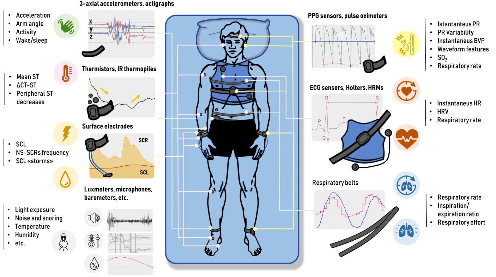
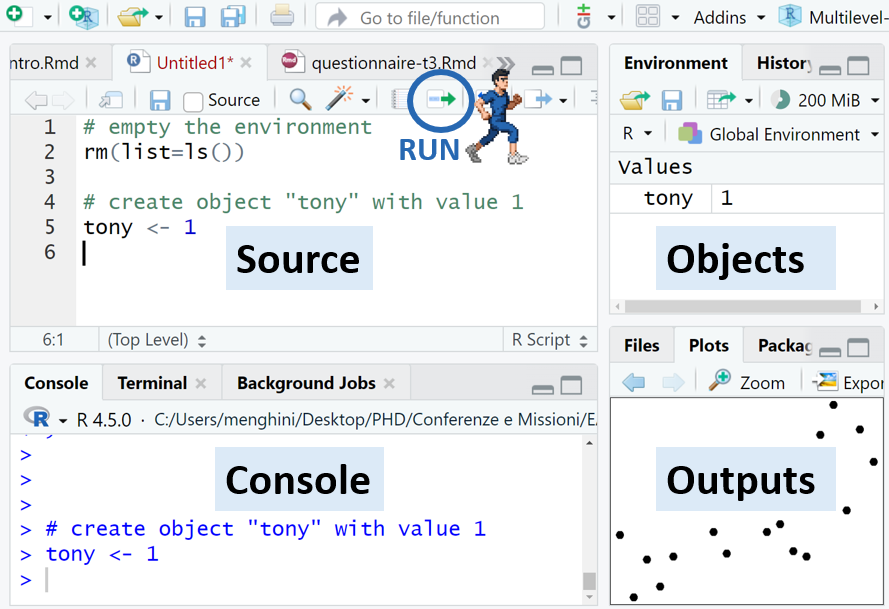
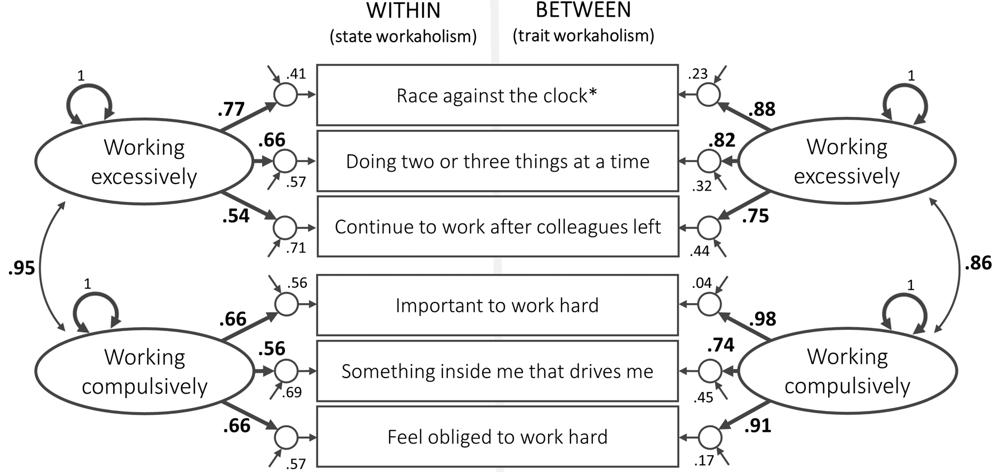
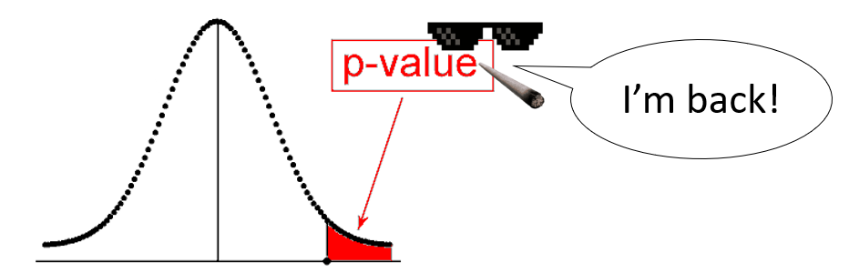

```{r}
#| echo: false
rm(list = ls())
library(fontawesome)
```

## About myself

:::: {.columns}
::: {.column width="27%"}

::: {style="font-size: 25px;"}

__Luca Menghini__ 

W/O Psychologist, <br>
Assistant Professor <br>
[University of Padova, Italy]{style="font-size: 18px;"}

{width="270px"}

```{r , echo = FALSE, out.width = "270px",fig.align="center"}
# knitr::include_graphics("img/logos.JPG")
```
  
:::
:::
::: {.column width="53%"}

::: {style="font-size: 22px;"}

::: {.nonincremental}

- `2016`: Msc in Work Psychology 

- `2016`: `r fa("heart", height = "1em",fill="#790000")``r fa("heart-pulse", height = "1em", fill="#790000")`

- `2017`: Consultance internship <br> 
*Biofeedback training in professional drivers* 

- `2018-19`: `r fa("heart", height = "1em",fill="#790000")``r fa("r-project", height = "1em",fill="#790000")` `r fa("heart", height = "1em",fill="#790000")``r fa("unlock", height = "1em",fill="#790000")` `r fa("heart", height = "1em",fill="#790000")``r fa("sitemap", height = "1em",fill="#790000")`

- `2020`: Visiting @SRI International (USA) <br> _*Wearable sleep trackers performance*_ 

- `2021`: Ph.D. @PsyPhyLab @uniPadova <br> _EMA of workplace stress_

- `2021`: Post-doc @uniBologna <br> _*The daily costs of workaholism*_ 

- `2022`: Post-doc @uniTrento <br> _*Youth transition pathways*_

- `2023`: Assistant Prof. @HTLab @uniPadova <br> _*Digitalization, work-life balance, & lifestyles*_ 

::: 

:::

:::

::: {.column width="20%"}

:::{.r-stack}
{.absolute top=0 .fragment right=0 width="400"}

{.absolute top=170 right=0 .fragment width="300"}

{.absolute top=270 right=0 .fragment width="300"}

{.absolute top=375 right=0 .fragment width="400"}

:::

:::

::::

## About yourselfs

```{r}
#| echo: false
#| warning: false
#| message: false
#| fig-width: 11
#| fig-height: 5.5
#| out-width: "100%"
#| fig-align: "center"
library(tidyverse); library(patchwork)
load("data/workshop.qs.RData")

library(tidyverse)
library(patchwork)

# recoding data
df_plot <- p %>%
  mutate(
    # R Experience
    R_exp_short = case_when(
      str_detect(R_exp, "who") ~ "R... who?",
      str_detect(R_exp, "Copy-Paste") ~ "Copy-Paste Warrior",
      str_detect(R_exp, "Comfortable") ~ "Comfortable-ish",
      str_detect(R_exp, "Wizard") ~ "R Wizard",
      TRUE ~ "Altro"
    ),
    R_exp_short = factor(R_exp_short, levels = c(
      "R... who?", "Copy-Paste Warrior", "Comfortable-ish", "R Wizard")),
    
    # Relationship with Stats
    stats_rel = case_when(
      str_detect(data.analysis, "complicated") ~ "💔 Complicated",
      str_detect(data.analysis, "Good friends") ~ "🤝 Friends",
      str_detect(data.analysis, "serious") ~ "🔥 Serious",
      str_detect(data.analysis, "Soulmates") ~ "👑 Soulmates",
      TRUE ~ "Altro"
    ),
    stats_rel = factor(stats_rel, levels = c(
      "💔 Complicated", "🤝 Friends", "🔥 Serious", "👑 Soulmates")),
    
    # ILD Experience
    ild_exp = case_when(
      str_detect(ild, "None") ~ "🥚 None",
      str_detect(ild, "send help") ~ "🧩 Have data",
      str_detect(ild, "Advanced") ~ "🚀 Advanced",
      TRUE ~ "Altro"
    ),
    ild_exp = factor(ild_exp, levels = c(
      "🥚 None", "🧩 Have data", "🚀 Advanced")),
    
    # Modelli Lineari (LM)
    lm_short = case_when(
      str_detect(lm, "Panic Mode") ~ "😱 Panic Mode",
      str_detect(lm, "Nostalgic Flashback") ~ "🤔 Nostalgic Flashback",
      str_detect(lm, "Business as Usual") ~ "😎 Business as Usual",
      str_detect(lm, "Professor") ~ "🤓 Professor Level",
      TRUE ~ "Altro"
    ),
    lm_short = factor(lm_short, levels = c("😱 Panic Mode", "🤔 Nostalgic Flashback", "😎 Business as Usual", "🤓 Professor Level")),
    
    # Regressione Multipla (nella colonna 'mlm' dei tuoi dati)
    multiple_reg = case_when(
      str_detect(mlm, "Not really") ~ "🛑 One step at a time",
      str_detect(mlm, "Yes, I know") ~ "✅ Can interpret coeffs",
      TRUE ~ "Altro"
    ),
    multiple_reg = factor(multiple_reg, levels = c("🛑 One step at a time", "✅ Can interpret coeffs")),
    
    # Modelli Multilivello (nella colonna 'multilevel')
    mlm_exp = case_when(
      str_detect(multilevel, "Never heard") ~ "🫥 Never heard of them",
      str_detect(multilevel, "theory") ~ "🧐 Know the theory",
      str_detect(multilevel, "tried using") ~ "🛠️ Tried using them",
      str_detect(multilevel, "breakfast") ~ "🚀 Eat them for breakfast",
      TRUE ~ "Altro"
    ),
    mlm_exp = factor(mlm_exp, levels = c("🫥 Never heard of them", "🧐 Know the theory", "🛠️ Tried using them", "🚀 Eat them for breakfast")),
    
    # Role
    role = case_when( # correcting mistake
      str_detect(position, "Associate") ~ "Professor",
      str_detect(position_7_TEXT, "Assistant") ~ "Assistant Prof.",
      str_detect(position, "Ph") ~ "Ph.D.",
      TRUE ~ position
    ),
    role = factor(role, levels = c("Ph.D.", "Post-doc", 
                                   "Assistant Prof.",  "Professor"))
  )

# Tema di base per tutti i grafici
my_theme <- theme_minimal(base_size = 14) +
  theme(
    plot.title = element_text(face = "bold", size = 14),
    axis.title.x = element_blank(),
    axis.title.y = element_blank(),
    panel.grid.major.y = element_blank(),
    panel.grid.minor.x = element_blank()
  )

# 2. Estrazione e pulizia dei software (scelta multipla)
software_df <- p %>%
  mutate(
    # Uniamo la colonna standard con il testo libero per l'opzione "Other"
    soft_raw = case_when(
      str_detect(other_software, "Other") ~ paste(other_software, other_software_9_TEXT, sep = ","),
      TRUE ~ other_software
    )
  ) %>%
  # Separiamo le risposte multiple divise da virgola su più righe
  separate_rows(soft_raw, sep = ",") %>%
  mutate(software = str_trim(soft_raw)) %>%
  # Rimuoviamo i valori vuoti o la stringa generica "Other (specify)"
  filter(software != "Other (specify)", !is.na(software), software != "NA", software != "") %>%
  count(software)

p1 <- df_plot %>%
  count(stats_rel) %>%
  ggplot(aes(x = n, y = fct_rev(stats_rel))) +
  geom_col(fill = "#4C72B0", alpha = 0.8) +
  scale_x_continuous(breaks = scales::pretty_breaks()) +
  labs(title = "I❤️Stats") +
  my_theme

p2 <- df_plot %>%
  count(R_exp_short) %>%
  ggplot(aes(x = n, y = fct_rev(R_exp_short))) +
  geom_col(fill = "#4C72B0", alpha = 0.8) +
  scale_x_continuous(breaks = scales::pretty_breaks()) +
  labs(title = "I❤️R") +
  my_theme

p3 <- software_df %>%
  ggplot(aes(x = n, y = reorder(software, n))) +
  geom_col(fill = "#542B23", alpha = 0.8) +
  scale_x_continuous(breaks = scales::pretty_breaks()) +
  labs(title = "Other Software 👎") +
  my_theme

p4 <- df_plot %>%
  count(lm_short) %>%
  ggplot(aes(x = n, y = fct_rev(lm_short))) +
  geom_col(fill = "#3A923A", alpha = 0.8) +
  scale_x_continuous(breaks = scales::pretty_breaks()) +
  labs(title = "Linear models") +
  my_theme

p5 <- df_plot %>%
  count(multiple_reg) %>%
  ggplot(aes(x = n, y = fct_rev(multiple_reg))) +
  geom_col(fill = "#E1812C", alpha = 0.8) +
  scale_x_continuous(breaks = scales::pretty_breaks()) +
  labs(title = "Multiple regression") +
  my_theme

p6 <- df_plot %>%
  count(mlm_exp) %>%
  ggplot(aes(x = n, y = fct_rev(mlm_exp))) +
  geom_col(fill = "#C03D3E", alpha = 0.8) +
  scale_x_continuous(breaks = scales::pretty_breaks()) +
  labs(title = "Multilevel models") +
  my_theme

p7 <- df_plot %>%
  count(ild_exp) %>%
  ggplot(aes(x = n, y = fct_rev(ild_exp))) +
  geom_col(fill = "#C44E52", alpha = 0.8) +
  scale_x_continuous(breaks = scales::pretty_breaks()) +
  labs(title = "ILD") +
  my_theme

# Uniamo i grafici con patchwork
(p1 | p2 | p3) / (p4 | p5 | p6 ) / p7 + 
  plot_annotation(
    caption = paste0("n = 12 responses (",
                     round(100*nrow(df_plot[df_plot$role=="Ph.D.",])/
                             nrow(df_plot),1),
                     "% PhDs) over 22 workshop participants"),
    theme = theme(plot.caption = element_text(size = 11, color = "gray50"))
  )
```

::: {.nonincremental}

::: {style="font-size: 22px;"}

- ESM study on burnout & resilience (5/d × 10d): pre-ESM-post

- ESM study on playful work & flow (1/d × 5d) by POS (*cross-level*)

:::
:::

## Workshop outline

::: {style="font-size: 1.1em;"}

- `r fa("chart-line", height = "1em", fill="#4657A9")` `ILD` × `OHP` <br>
Investigating within-person relationships of stressors & strain

- `r fa("r-project", height = "1em", fill="#4657A9")` `R basics`  <br>
Warm up & loading data

- `r fa("sitemap", height = "1em", fill="#4657A9")` `LMER intro` <br>
From linear models to multilevel modelling 

- `r fa("laptop-code", height = "1em", fill="#4657A9")` `HandZone` <br>
From data pre-processing to cross-level interactions 

- `r fa("rocket", height = "1em", fill="#4657A9")` `LMER advanced` <br>
3-level models, growth curve and cross-lagged models, mediation, GLMER

:::

# `r fa("chart-line", height = "1em", fill="#4657A9")` <br> Intensive Longitudinal Designs <br> in Occupational Health Psychology

## Intensive Longitudinal Designs (ILD)

`r fa("umbrella", height = "1em")` Umbrella term for data sampling techniques involving numerous data points (e.g., 10-to-50 observations per participant) and short time lags (e.g., minutes, days, weeks) to capture temporal dynamics that cannot be unravelled with lower sampling rates <br> [Bolger and Laurenceau (2013);](https://books.google.fi/books?hl=it&lr=&id=5bD4LuAFq0oC&oi=fnd&pg=PP1&dq=Bolger,N.,+and+J.-P.+Laurenceau.+2013.+Intensive+LongitudinalMethods.An+Introduction+to+Diary+and+Experience+Sampling+Research.+Guilford+Press.&ots=jonj3Uz-62&sig=Lnwc4bB5MGp5tfvm0GUB4Yda-Rk&redir_esc=y#v=onepage&q=Bolger%2CN.%2C%20and%20J.-P.%20Laurenceau.%202013.%20Intensive%20LongitudinalMethods.An%20Introduction%20to%20Diary%20and%20Experience%20Sampling%20Research.%20Guilford%20Press.&f=false){style="font-size: 22px;"} [Revelle and Wilt (2019)](https://doi.org/10.1016/j.paid.2017.08.020){style="font-size: 22px;"} <br> <br>

- Goal: "*to study people’s thoughts, feelings, physiology, and behaviors in situ with enough repeated measurements to model change processes for each individual*" [(Laurenceau et al 2026)](https://doi.org/10.1146/annurev-psych-040325-025418){style="font-size: 22px;"}

- Continuous, momentary, daily, weekly, monthly

## ILD landscape

- `r fa("heart-pulse", height = "1em")` `Ambulatory Assessment`  <br>
Ecological methods to assess ongoing behaviors and physiology in natural environments <br>
[Society for Ambulatory Assessment](https://ambulatory-assessment.org/){style="font-size: 18px;"}

- [`r fa("clipboard-list", height = "1em")` 
`Experience Sampling Methods`]{style="font-size: 28px;"} <br>
Repeated sampling of ongoing psychology, experiences, and activities to study their intensity, frequency, and temporal patterns <br>
[Csikszentmihalyi (1987)](https://doi.org/10.1097/00005053-198709000-00004){style="font-size: 18px;"}

- [`r fa("heart-pulse", height = "1em")` `r fa("clipboard-list", height = "1em")` `Ecological Momentary Assessment`]{style="font-size: 28px;"} <br>
Repeated sampling of subjects' behaviors and experiences <br> in real time, in participants' natural environments <br>
[Shiffman et al (2008)](https://doi.org/10.1146/annurev.clinpsy.3.022806.091415){style="font-size: 18px;"}

## Which designs?

```{r}
#| echo: false
#| results: false

library(ggplot2)
library(patchwork) 

# 1. basic graph
p <- ggplot() +
  geom_rect(aes(xmin=4,xmax=10,ymin=0,ymax=1), fill="#c6dbef", color="black", linewidth=1) +
  geom_rect(aes(xmin=20,xmax=26,ymin=0,ymax=1), fill="#c6dbef", color="black", linewidth=1) +
  geom_rect(aes(xmin=10,xmax=20,ymin=0,ymax=1), fill="white", color="black", linewidth=1) +
  geom_segment(data=data.frame(x=seq(11,19,1)), aes(x=x,xend=x,y=0,yend=1), linetype="dashed") +
  scale_x_continuous(breaks=seq(4,26,by=2),
                     labels=c(paste0(seq(4,10,2),"AM"), paste0(c(12,seq(2,12,2)),"PM"), "2AM")) +
  theme_void() +
  theme(
    axis.text.x = element_text(size = 11, color = "#333333", margin = margin(t = 6)),
    plot.margin = margin(t = 15, r = 5, b = 15, l = 5, unit = "pt")
  )

# 2. SIGNAL CONTINGENT
p1a <- p + geom_point(data=data.frame(x=seq(10.5,19.5,by=1.5)), aes(x=x,y=0.5), color="red", size=5) +
           coord_cartesian(ylim=c(-0.4, 1.2), clip="off")

p1b <- p + geom_point(data=data.frame(x=c(10.3,12.8,14.5,15.1,17.5,18.2)), aes(x=x,y=0.5), color="red", size=5) +
           coord_cartesian(ylim=c(-0.4, 1.2), clip="off")
p1 <- p1a / p1b

# 3. EVENT CONTINGENT
p2 <- p +
  geom_point(data=data.frame(x=c(11.5,14.25,14.75,16.75)), aes(x=x,y=0.5), color="#4a7ebb", size=8) +
  geom_text(data=data.frame(x=c(11.5,14.25,14.75,16.75)), aes(x=x,y=0.5,label="E"), color="white", fontface="bold", size=4) +
  geom_point(data=data.frame(x=c(11.5,14.25,14.75,16.75)), aes(x=x,y=1.4), color="red", size=5) +
  coord_cartesian(ylim = c(-0.4, 1.7), clip = "off")

# 4. CONTINUOUS SAMPLING
p3 <- p +
  geom_segment(aes(x = 10.2, xend = 19.8, y = 0.5, yend = 0.5), 
               arrow = arrow(length = unit(0.4, "cm"), type = "closed"), 
               color = "red", linewidth = 2.5) +
  coord_cartesian(ylim = c(-0.4, 1.2), clip = "off")
```

::: {style="font-size: 0.65em;"}

- `Signal-contingent sampling:` Recording at fixed (e.g., hourly, daily, weekly), <br>random (whatever time), or semi-random intervals (e.g., each 90 ± 30 min) <br> 
  ```{r}
  #| echo: false
  #| fig-width: 7
  #| fig-height: 2
  #| fig-align: "center"
  p1
  ```

- `Event-contingent sampling:` Recording conditional to events <br>
(e.g., bedtime, activity, physiological trigger) <br> 
  ```{r}
  #| echo: false
  #| fig-width: 7
  #| fig-height: 1
  #| fig-align: "center"
  p2
  ```

- `Continuous sampling:` Passive monitoring (e.g., pedometer) <br>
  ```{r}
  #| echo: false
  #| fig-width: 7
  #| fig-height: 0.9
  #| fig-align: "center"
  p3
  ```

:::


## Advanced designs

::: {.nonincremental}

- Experimental designs: <br> RCT, Ecological Momentary Interventions, and Just-in-time adaptive interventions (JITAI)

- Measurement Burst Designs: <br> ILD 1 $\rightarrow$ time lag/intervention $\rightarrow$ ILD 2

- Dyadic ILDs: <br> leader-employee, employee-spouse, etc.

- Methodological triangulation: <br> e.g., other-report, physiological, behavioral

:::

[Sonnentag et al (2026)](https://doi.org/10.1026/0932-4089/a000478){style="font-size: 18px;"}

## Wearable technology

```{r}
#| echo: false
#| out-width: "290px"
#| fig-align: center

```


::: {style="font-size: 0.5em;"}
de Zambotti, M., Cellini, N., Menghini, L., Sarlo, M., & Baker, F. C. (2020).
Sensors capabilities, performance, and use <br> of consumer sleep technology.
Sleep medicine clinics, 15(1), 1-30. [https://doi.org/10.1016/j.jsmc.2019.11.003]()
:::

## Laboratory vs. Ambulatory assessment

{width="300"}

:::: {.columns}

::: {.column width="50%"}
### 

<ul>
  <li class="fragment" data-fragment-index="1">Real-time recording `r fa("check", height = "1em", fill = "green")`</li>
  <li class="fragment" data-fragment-index="2">High internal validity `r fa("check", height = "1em", fill = "green")`</li>
  <li class="fragment" data-fragment-index="3">Low ecological validity `r fa("xmark", height = "1em", fill = "red")`</li>
  <li class="fragment" data-fragment-index="4">Gold-standard recording `r fa("check", height = "1em", fill = "green")`</li>
</ul>
:::

::: {.column width="50%"}
### 

<ul>
  <li class="fragment" data-fragment-index="1">Real-time recording `r fa("check", height = "1em", fill = "green")`</li>
  <li class="fragment" data-fragment-index="2">Low internal validity `r fa("xmark", height = "1em", fill = "red")`</li>
  <li class="fragment" data-fragment-index="3">High external validity `r fa("check", height = "1em", fill = "green")`</li>
  <li class="fragment" data-fragment-index="4">Ambulatory recording `r fa("xmark", height = "1em", fill = "red")`</li>
</ul>
:::

::::

- __Measurement reactivity__ (e.g., white coat effect)

- __Lab-to-real world generalizability__: Lab stressors <br> are not representative of 'natural' stressors in terms of <br> duration, number, nature, and intensity

## Laboratory vs. Ambulatory assessment

::: {width="800"}


::: {style="font-size: 0.8em; text-align: center;"}

[Wilhelm & Grossman (2010)](https://doi.org/10.1016/j.biopsycho.2010.01.017)

:::
:::


## From ILD to Multilevel modelling

:::: {.columns}

::: {.column width="35%"}

```{r}
#| echo: false
#| warning: false
#| message: false
#| fig-width: 3
#| fig-height: 3
#| out-width: "300px"
#| fig-align: center

p <- data.frame(
  Person = c(rep("Lumi", 5), rep("Toivo", 5)),
  Time   = c(rep(1:5, 5), rep(1:5, 5)),
  Physiological.act = c(5.5, 4, 4.7, 5.3, 4.5,
                        2.5, 4, 2.7, 3.5, 3.3),
  Mean   = c(rep(4.8, 5), rep(3.2, 5))
)
fluct <- ggplot(p, aes(x = Time, y = Physiological.act, color = Person)) +
  geom_smooth(se = FALSE) + geom_point(size = 3) +
  geom_hline(aes(yintercept = Mean, color = Person),
             linewidth = 2, lty = 2, alpha = 0.4) +
  ylab("Stress level") +
  theme(text = element_text(size = 15),
        legend.position = "top")

fluct
```

:::

::: {.column width="65%"}

- When a random variable is measured repeatedly, multilevel models **partition the variance** into `within-subject` (**lv1**) and `between-subject` (**lv2**).

- The same when individuals (e.g., workers) are nested `within groups` (e.g., teams) 

:::
::::

- `Between (lv2):` Stable individual traits (time-invariant component) <br>
[ *Do individuals with higher trait rumination sleep less hours than individuals with lower trait rumination?* ]{style="color: blue;"} <br>

- `Within (lv1):` Variable transient states (time-varying component) <br>
[ *Does individuals sleep less hours than usual in those days where they ruminate more than usual?*]{style="color: blue;"}

# `r fa("r-project", height = "1em", fill="#4657A9")` <br> Short introduction to R

## Why `r fa("r-project", height = "1em", fill="#4657A9")`? {.smaller}

R is an open source programming language and environment <br> for **statistical computing** and **graphics**.

:::: {.columns}

::: {.column width="20%"}


:::

::: {.column width="80%"}

- Open source (not a black box)

- Reproducible & fully controllable

- User friendly (optimized default functions)

- High-quality outputs

- Integrated with LateX, Markdown, Quarto, etc.

- Documented: try `?mean` + thousands of tutorials

- Still don't know how to do it? Ask LLM ;)

- Free software (GNU GP, usable anywhere worldwide)

- Community-based: <br> **R Core Team** periodically updating `base R` <br> + thousands of researchers developing <br> new **packages** exponentially

:::

::::

## RStudio {.smaller}

= Development environment for `r fa("r-project", height = "1em", fill="#4657A9")` using an **optimized graphical interface** <br> to make it simpler.

:::: {.columns}

::: {.column width="60%"}



:::

::: {.column width="40%"}

- **Console**: Just write a command and execute it with `Enter`

- **Source**: R Scripts (`.R`), docs & presentations (`.Rmd`/`qmd`), GUIs (`.app`), etc. <br> \color{red} *To run a command, select it and tap `Ctrl + Enter` or click on the `Run` button on the top-right* \color{red} 

- **Environment**: R objects included in the workspace

:::

::::

## Some basic commands {.smaller}

:::: {.columns}

::: {.column width="50%"}

::: {.chunk-short}
  
- Comments (`#`)
  ```{r}
  #| echo: true
  # this is a comment
  ```
  
- Simple mathematical operations
  ```{r }
  #| echo: true
  2 + 2 # sum
  2 * 2 # multiplication
  log(3) # natural logarithm
  exp(1) # exponential function
  ```

- Longer expressions 
  ```{r}
  #| echo: true
  sqrt(5) * ( (4 - 1/2)^2 - pi/2^(1/3) )
  ```
:::
::: 
::: {.column width="50%"}

::: {.chunk-short}
  
- Assigning values to **objects** (`<-`)
  ```{r }
  #| echo: true
  x <- 3 # creates the 'x' object with value 3
  x # pint the value of x
  ```

- Objects' names can include letters, numbers, underscores, and, dots (e.g. `tony`, `tony.1_`)
  ```{r }
  #| echo: true
  tony_32 <- x / 3 # assign a value to the object
  tony_32 # print the object's value
  ```

- Key-sensitive but not sensitive to spaces
  ```{r }
  #| echo: true
  #| eval: false
  Tony_32
  ```
  {width="300"}
  ```{r }
  #| echo: true
  3+tony_32; 3     +  tony_32
  ```
:::
:::
::::


::: {style="font-size: 0.90em;"}
::: {.purple-block}

- `r fa("laptop-code", height = "1em")` Assign $log(\sqrt{5.5^2})$ to object `a` and $(3 \times 2.2)^2/4$ to object `b`; <br> then sum the two objects (should be 13.45)

:::
:::

## Relational & logical operators{.smaller}

:::: {.columns}

::: {.column width="50%"}

- Relational operators
  ```{r }
  #| echo: true
  3 == 3 # equal to
  3 != 3 # different from
  x >= 3 # higher than or equal to
  5 %in% c(3, 5, 8) # included in
  ```

::: 
::: {.column width="50%"}

- Logical operators
  ```{r }
  #| echo: true
  x <- TRUE
  y <- !x # negation of y
  x & (5 < 2) # joined condition
  x | (5 < 2) # inclusive disjoint
  ```

:::
::::

::: {.purple-block}

- `r fa("laptop-code", height = "1em")` Write a command to test whether object `a` is equal to object `b` <br> or higher than the sum of `a + b` (should be FALSE)

:::

## Types of R objects (classes) {.smaller}

:::: {.columns}

::: {.column width="50%"}
  
- **Logical**
  ```{r }
  #| echo: true
  x <- TRUE
  x <- T # "TRUE" or "T" is the same
  class(x)
  ```

- **Numeric**
  ```{r }
  #| echo: true
  x <- 1.4
  class(x)
  ```

- **Integer**
  ```{r }
  #| echo: true
  as.integer(x)
  ```

- **Character**
  ```{r }
  #| echo: true
  x <- "I    like R"
  x # within "" the space matters!
  ``` 
  
:::

::: {.column width="50%"}
  
- **Vector**: series of values with the same class (e.g., all numeric) combined with the function `c()` (*combine*)
  ```{r }
  #| echo: true
  x <- c(1, 10.5, 3, 2)
  x + 1
  sqrt(x)
  y <- c("I","like", "R")
  ```

- **Matrix**: table with `nrow * ncol`
  ```{r }
  #| echo: true
  x <- matrix(1:12, nrow = 3, ncol = 4)
  rownames(x) <- y # row names
  x
  ```
:::
::::

## Types of R objects: `data.frame` {.smaller}

::: {.nonincremental}

Bidimensional structure of vectors with different
classes (e.g., numeric, character, factor):
`data.frame(name_var1 = c(...), name_var2 = ...)`

:::

:::: {.columns}

::: {.column width="50%"}

- `str(df_name)` returns the df structure

  ```{r }
  #| echo: true
  x <- data.frame( # create df
     Num = 1:4,
     Char = c("a","b","c","d"),
     Logi = c(T,F,F,T))
  x # print df
  str(x) # df structure
  ```
 
:::
  
::: {.column width="50%"}

- To select a column (vector) from a dataframe, we can use the `$` symbol with the syntax `df_name$column_name`
  ```{r }
  #| echo: true
  x$Char # selecting the Char column
  x$Char[2] # second value from the Char column
  x$Char[2] == x[2,2] # equivalent commands
  x[x$Num < 3,] # selecting cases with Num < 3
  ``` 

:::

::::

::: {.purple-block}

- `r fa("laptop-code", height = "1em")` Create a data.frame with a column for students names (i.e., Jon, Jin, Jun) <br> and a column for grades (i.e., 10, 6, 8); then select the row corresponding to Jin.

:::

## How to load your data: set the work directory {.smaller}

To read a file from a specific folder, you should first get or set the **working directory** (WD), that is the folder where input files are searched and where output files are saved.

```{r }
#| echo: true
#| eval: false
# prints the current WD
getwd() 

# changes WD to the 'data' subfolder
setwd("data") 

# set a new WD
setwd("C:/Users/mengh/OneDrive/Desktop") # set new WD
```

- **Trick with RStudio**: when you start a new project (e.g., data analysis for the thesis, report), create a new **R project** (`.Rproj`) from the menu `File > New R Project` by selecting an existing folder or by creating a new one, which will be the default WD for any file related to that project <br> <br>

::: {.purple-block}

- `r fa("laptop-code", height = "1em")` Get your WD; create a folder on your desktop and set it as your new WD

:::

## How to load your data: data reading {.smaller}

The first step in any data analysis with R is to read a dataset To do so, we need to use a specific function depending on the data format \newline (e.g., CSV, xlsx, txt, sav). 

- The default R data format is RData.
  ```{r }
  #| echo: true
  #| eval: false
  
  load(file = "data/S2_data.RData") # import
  save(qs, file = "data/S2_data.RData") # export
  ```

```{r }
dat <- read.csv("data/S2_data.csv")
```

- But it can read and export further data formats, <br> some of which require to install additional packages.
  ```{r }
  #| echo: true
  #| eval: false
  # Comma separated values (csv)
  qs <- read.csv(file = "data/S2_data.csv") # import
  write.csv(x = qs,"data/S2_data.csv") # export
  
  # SAV (SPSS)
  library(foreign)
  qs <- read.spss("data/studqs.sav",to.data.frame=T)
  ```

::: {.purple-block}

- `r fa("laptop-code", height = "1em")` Download the `S2_data` file from [osf.io/awbxj/files/nv7ux](https://osf.io/awbxj/files/nv7ux)

- `r fa("laptop-code", height = "1em")` Save it in your WD; read it in R calling it "dat"

- `r fa("laptop-code", height = "1em")` Inspect the dataset with the command `View(dat)`

:::

## Which dataset is it?

<br> <br>

:::: {.columns}
::: {.column width="49%"}

{width="500"}

::: {style="font-size: 0.6em;text-align: justify;"}

...we developed and evaluated parsimonious measures of momentary stressors (Task Demand and Task Control) and the Italian adaptation of the Multidimensional Mood Questionnaire as an indicator of momentary strain (Negative Valence, Tense Arousal, and Fatigue). Data from 139 full-time office workers that received seven experience sampling questionnaires per day over 3 workdays
suggested satisfactory validity...

::: 

:::
::: {.column width="2%"}
:::
::: {.column width="49%"}

{width="500"}

::: {style="font-size: 0.6em;text-align: justify;"}

...Using an intensive longitudinal design over 10 workdays with 114 workers from various occupations (2,534 measurement occasions), we found higher systolic and diastolic blood pressure, emotional exhaustion, and sleep
disturbances in workdays characterized by higher-than-usual workaholism symptoms ...  Finally,we found evidence of a buffering
effect of evening psychological detachment...

::: 

::: {.fragment}

::: {style="font-size: 2em;text-align: center;"}

`r fa("trophy",fill="#D0AD30")`

:::

:::

:::

::::

## The dataset {.smaller}

:::: {.columns}
::: {.column width="50%"}

{width="500px"}

::: {style="font-size: 0.6em;"}
::: {.nonincremental}

- `ID`: participant's code

- `day`: participation day (1-10)

- `SBP_aft`, `DBP_aft`: blood pressure in the afternoon (mmHg)

- `WHLSM1` ... `WHLSM6`: state workaholism (1-7)

- `SBP_eve`, `DBP_eve`: blood pressure in the evening (mmHg)

- `EE1` ... `EE4`: emotional exhaustion at bedtime (1-7) 

- `R.det1` ... `R.det3`: psych detachment in the evening (1-7)

- `SQ1` ... `SQ4`: morning ratings of sleep disturbances (1-7)

- `gender`: "F" or "M"

- `age`: years of age

- `BMI`: body mass index ($kg/m^2$)

- `IN.resp`: response rate inclusion criteria (TRUE/FALSE)

- `IN.bp`: blood pressure inclusion criteria (TRUE/FALSE)

:::
:::
::: 
::: {.column width="50%"}

```{r}
#| echo: true
str(dat) # data structure
```

::: 
::::

## Workspace: Functions & packages {.smaller}

::::: {.columns}
:::: {.column width="45%"}
::: {.chunk-short}

- Many things in R can be done by using **functions**, which always include the function name and *arguments* (`arg_name = arg_value` or without name, based on the default position)
  ```{r}
  #| echo: true
  mean(x = c(1,2,3))
  mean(c(1,2,3))
  ```

- **R Help system**: To know the details of any function (arguments, value, etc.), just add the `?` symbol before the function name
  ```{r}
  #| echo: true
  #| eval: false
  ?mean
  ```
  
:::
::::

:::: {.column width="55%"}

- **R packages**: To get additional functions than those included in the base R packages, you need to install and open the related package
  ```{r }
  #| echo: true
  #| eval: false
  install.packages("pkg_name") # install
  library(pkg_name) # open package
  ```

::: {.purple-block}

- `r fa("laptop-code", height = "1em")` Compute the `mean` of the variable `SBP_aft` for each participant `ID` using the function `aggregate` with the following syntax:
  ```{r}
  #| echo: true
  #| eval: false
  aggregate(variable ~ participant, 
            data = mydataset, FUN = function, 
            na.rm = TRUE)
  ```

- `r fa("laptop-code", height = "1em")` Install the package `psych` and use the `describe` function to compute the descriptive statistics of the variables `SBP_aft` and `WHLSM1`

:::

::::


:::::

## Time for a (micro) break!

{width="50%"}

But before it write this code on your console and run `r fa("person-running", height = "1em")` `r fa("mug-hot", height = "1em")`

```{r }
#| echo: true
#| eval: false
install.packages("multilevelTools") # reliability
install.packages("plyr") # data merging
install.packages("lme4") # multilevel
install.packages("sjPlot") # visuals
```

# `r fa("sitemap", height = "1em", fill="#4657A9")` <br> LMER intro: <br> From linear models <br> to multilevel modelling

## Linear models (LM) {.smaller}

::: {.nonincremental}

LM allow to determine the link between two variables <br>
as expressed by a linear function: [$y_i = \beta_0 + \beta_1 x_i + \epsilon_i$]{style="color: red; font-size: 1.2em;"} <br>
which can be graphically represented as a straight line, where:

- [$\beta_0$]{style="color: red;"} is the intercept (value assumed by $y$ when $x = 0$)
- [$\beta_1$]{style="color: red;"} is the slope (predicted change in $y$ when $x$ increases by 1 unit)
- [$\epsilon_i$]{style="color: red;"} are the errors (distance between observation $i$ and the regression line)

:::

:::: {.columns}

::: {.column width="40%"}

```{r}
#| echo: false
#| fig-width: 4.5
#| fig-height: 2.5
#| out-width: "550px"
par(mar=c(0, 4, 0, 2) + 0.1,mai = c(0.8, 0.7, 0, 0.7))
x <- rnorm(n = 100)
y <- x + rnorm(n = 100)
plot(y~x,pch=19,col="gray",cex=0.8)
abline(lm(y~x),col="red",lwd=2)
abline(v=0,lty=2,col="gray")
abline(h=summary(lm(y~x))$coefficients[1,1],lty=2,col="gray")
text(x=0.5,y=summary(lm(y~x))$coefficients[1,1],labels=paste("B0 =",round(summary(lm(y~x))$coefficients[1,1],2)))
text(x=min(x)+0.5,y=min(y)+0.5,labels=paste("B1 =",round(summary(lm(y~x))$coefficients[2,1],2)))
```

::: 

::: {.column width="60%"}


- $x_i$ and $y_i$ are the values of observation $i$ <br> for the **casual variables** $x$ and $y$ 

- $\beta_0$, $\beta_1$, and $\epsilon_i$ are called "**parameters**", or "**coefficients**". They are *estimated* from the sampled data and *generalized* to the whole population.

:::
::::

## LM core assumptions 

::: {.incremental}

1. **Linearity**: $x_i$ and $y_i$ are linearly associated <br> $\rightarrow$ the expected (mean) value of $\epsilon_i$ is zero

2. **Normality**: Residuals $\epsilon_i$ are normally distributed with $\epsilon_i \sim \mathcal{N}(0,\,\sigma^{2})$

3. **Homoscedasticity**: $\epsilon_i$ variance is constant over the levels of $x_i$ (homogeneity of variance)

4. **Independence of predictors & errors**: Predictors $x_i$ <br> are unrelated to residuals $\epsilon_i$

5. [**Independence of observations**]{style="color: red;"} <br>
    For any two observations $i$ and $j$ with $i \neq j$, the residual terms $\epsilon_i$ and $\epsilon_j$ are independent (no common disturbance factors)

:::

## Linear models in `r fa("r-project", height = "1em",fill="#4657A9")` {.smaller}

:::: {.columns}

::: {.column width="50%"}

Basic syntax:
```{r}
#| echo: true
#| eval: false
# null model
m0 <- lm( y ~ 1, data = mydataset)

# simple regression
m1 <- lm( y ~ x1, data = mydataset)

# multiple regression
m2 <- lm( y ~ x1 + x2 + x3 + ..., 
          data = mydataset)
```

- For instance:
  ```{r}
  #| echo: true
  # fit model
  m <- lm( SBP_aft ~ WHLSM1, data = dat)
  
  # results
  summary(m)$coefficients
  ```

:::
::: {.column width="50%"}


```{r}
#| echo: true
#| eval: false
# fit and assumptions
par(mfrow=c(2,2),mai=rep(0.3,4)); plot(m)
```

:::
::::

## Nested data & Local dependencies {.smaller}

<br>

:::: {.columns}
::: {.column width="30%"}

::: {style="font-size: 1.3em;"}

```{r}
#| echo: false
data.frame(
  Person = c(rep("Lumi", 5), rep("Toivo", 5)),
  Time = c(1:5, 1:5),
  Y = c(5.5, 5, 4.7, 5.3, 4.5, 2.5, 3, 2.7, 3.5, 3.3) - 2.5
)
```

:::

:::

::: {.column width="70%"}

- Repeated-measure designs always result in **nested data structures** where level-1 individual observations <br> (i.e., statistical units) are nested within level-2 **cluster variables** (e.g., participants)

- [Nested data structures are incompatible with the LM assumption of independence of observations]{style="color: red;"}

- **Local dependencies** = correlations that exist among observations within a specific cluster <br> (but the software doesn't know!) 
  - Biased standard errors (++ false positives)
  - Neglected cluster-level variables potentially affecting <br> level-1 relationships (e.g., cross-level interactions)


:::
:::::

## Linear mixed-effects regression models (LMER) {.smaller}


Multilevel models are part of the largest **LMER family** that include <br> **additional variance terms** for handling local dependencies.

<br>

- [Why 'mixed-effects'?]{style="font-size: 1.2em;"} <br> Because such additional terms come from the distinction between:

  - [**Fixed effects**]{style="color: red;"}: effects that remain ***constant across clusters*** whose levels are *exhaustively considered* by the researcher (e.g., gender, steps of Likert scales, experimental conditions)

  - [**Random effects**]{style="color: red;"}: effects that ***vary from cluster to cluster*** whose levels are *randomly sampled* from a population (e.g., organizations, people)

<br>

- Let the visuals talk! <br>
 [[http://mfviz.com/hierarchical-models/](http://mfviz.com/hierarchical-models/)]{style="color: blue;"} <br>
[Michael Freeman (2017)]{style="font-size: 0.6em; color: #666;"}

## From LM to LMER {.smaller}

:::: {.columns}
::: {.column width="50%" .nonincremental}

LM formula: $y_i = \beta_0 + \beta_1 x_i + \epsilon_i$ 

- Intercept and slope are **constant across all individual observations** $i$ within the population

- $x$, $y$, and the error term $\epsilon$ only variate across individual observations $i$

:::

::: {.column width="50%" .nonincremental}

LMER formula: $y_{i{\color{purple}j}} = \beta_{0{\color{purple}j}} + \beta_{1{\color{purple}j}} x_{i{\color{purple}j}} + \epsilon_{i{\color{purple}j}}$ 

- Intercept and slope have both a **fixed** ($_{0/1}$) and a **random** component ( $_j$)

- $y$, $x$, and $\epsilon$ vary across **individual observations** $i$ as well as across **clusters** $\color{purple}j$

:::

::::

::: {.incremental style="text-align: center; font-size: 1.15em; margin-top: 25px; margin-bottom: 15px;"}

$$
y_{ij} = \color{blue}{\beta_{0j}} + \color{red}{\beta_{1j}}x_{ij} + \epsilon_{ij} = \color{blue}{(\beta_{00} + \lambda_{0j})} + \color{red}{(\beta_{10} + \lambda_{1j})}x + \epsilon_{ij}
$$

:::

- LMER are an extension of LM where the [intercept]{style="color: blue;"} and the [slope]{style="color: red;"} are decomposed into:

  - the **fixed components** $\color{blue}{\beta_{00}}$ and $\color{red}{\beta_{10}}$, referred to the whole sample
  - the **random components** $\color{blue}{\lambda_{0j}}$ and $\color{red}{\lambda_{1j}}$, randomly varying across clusters

## Random intercept {#randint .smaller}

Let's start with a **null model** (intercept-only) where Burnout ($y_{ij}$) <br> is only predicted by the intercept $\beta_{00}$ and the residuals $\epsilon_{ij}$

- *LM*: $y_{i} = \beta_0 + \epsilon_i$ <br>
   The intercept value $\beta_0$ is common to all observations 

- *LMER*: $y_{i{\color{blue}j}} = \beta_{0{\color{blue}j}} + \epsilon_{i{\color{blue}j}} = (\beta_{00} + \color{blue}{\lambda_{0j}}) + \epsilon_{ij}$

  - $\beta_{00}$ is the **fixed intercept** that applies to all observations = sample's grand average

  - [$\lambda_{0j}$]{style="color: blue;"} is the [**random intercept**]{style="color: blue;"} = cluster-specific deviation from the fixed intercept <br> = person's average burnout - sample's grand average

::: {.r-stack}

::: {.fragment}

```{r}
#| warning: false
#| message: false
#| echo: false
#| fig-width: 8
#| fig-height: 2.5
#| out-width: "100%"

itp <- read.csv("data/studentData.csv")
itp$class <- as.factor(itp$classID)
library(lme4)
library(ggplot2)
itp$math_grade <- itp$math_grade - min(itp$math_grade) + 1

m0 <- lmer(math_grade ~ (1|classID), data = itp)
fixInt <- fixef(m0)
randInt <- ranef(m0)[[1]]
randInt$class <- rownames(randInt)
randInt$classGrade <- fixInt + randInt$`(Intercept)`
randInt$y <- c(8.75, 7.5, 6.25, 5)
randInt$xlabel <- c(rep(fixInt, 2), randInt$classGrade[3:4])
randInt$label <- paste("Person", c("A", "B", "C", "D"), "- expression(beta)")

p <- ggplot(itp, aes(math_grade)) + 
  geom_histogram(position="identity", alpha=0.6, fill="gray50", color="white") + 
  ylab("N. of observations") + 
  xlab("Burnout") +
  geom_vline(aes(xintercept=fixInt), lwd=1.5) +
  geom_vline(data=randInt, aes(xintercept=classGrade, lty=class)) +
  ylim(0, 11) + 
  labs(lty="Mean Burnout\nin person:") +
  geom_label(aes(x=fixInt+0.31, y=10.5), 
             label="Fixed~intercept~beta[0][0]", alpha=0.7, parse=TRUE) +
  theme_minimal() +
  theme(plot.background = element_rect(fill = "white", color = NA))
p
```

:::

::: {.fragment}

```{r}
#| warning: false
#| message: false
#| echo: false
#| fig-width: 8
#| fig-height: 2.5
#| out-width: "100%"

p +
  geom_segment(data=randInt, aes(x=classGrade, xend=fixInt, y=y, yend=y),
               arrow=arrow(ends="both", length=unit(0.2, "cm")), color="blue") +
  geom_label(data=randInt, 
             aes(x=xlabel+0.28, y=y,
                 label=paste("lambda[0][", 1:4, "]==person~", 
                             class, "~-~beta[0][0]")),
             parse=TRUE, size=3.5, color="blue", alpha=0.7) + 
  ylim(0, 11) + 
  labs(lty="Mean Burnout\nin person:") +
  theme_minimal() +
  theme(plot.background = element_rect(fill = "white", color = NA))
```

:::

:::

## Random slope {.smaller}

Let's now add a predictor: **Workload levels** $x_{ij}$

::::: {.columns}
:::: {.column width="45%"}


[**Random intercept**]{style="color: blue;"} model 

$y_{ij} = \color{blue}{\beta_{0j}} + \beta_1x_{ij} + \epsilon_{ij}$ <br> $=\color{blue}{(\beta_{00} + \lambda_{0j})} + \beta_1x_{ij} + \epsilon_{ij}$

$y_{ij}$ is predicted by the overall mean Burnout $\beta_{00}$, its ***average relationship*** with Workload $\beta_{10}$, the [random variation among clusters $\lambda_{0j}$ (***random intercept***)]{style="color: blue;"}, and the random variation within clusters $\epsilon_{ij}$ (*residuals*)
```{r}
#| warning: false
#| message: false
#| echo: false
#| fig-width: 4
#| fig-height: 2.2
library(sjPlot)
itp$Person <- itp$classID
m1 <- lmer(math_grade ~ anxiety + (1|Person), data = itp)

plot_model(m1, type="pred", terms=c("anxiety", "Person"), 
           ci.lvl=NA, pred.type = "re", title ="") +
  ylab("Burnout") + xlab("Workload") +
  geom_point(data=cbind(itp, group_col=itp$Person), 
             aes(anxiety, math_grade)) + 
  ylim(6.5, 9.5) +
  theme_minimal()
```

::::

:::: {.column .fragment width="55%"}

[**Random intercept**]{style="color: blue;"} & [**random slope**]{style="color: red;"} model 


$y_{ij} = \color{blue}{\beta_{0j}} + \color{red}{\beta_{1j}}x_{ij} + \epsilon_{ij}$ <br> $=({\beta_{00} + \color{blue}{\lambda_{0j}}}) + ({\beta_{10} + \color{red}{\lambda_{1j}}}) x_{ij} + \epsilon_{ij}$

Since the effect of Workload might not be the same across all persons, we partition $\beta_{1}$ into the overall ***average relationship*** between calmness and physiological activity $\beta_{10}$ (*fixed slope*) and the [cluster-specific variation in the relationship $\lambda_{1j}$ (***random slope***)]{style="color: red;"} - basically an interaction
```{r}
#| warning: false
#| message: false
#| echo: false
#| fig-width: 4
#| fig-height: 2.2
m2 <- lmer(math_grade ~ anxiety + (anxiety|Person), data = itp)

plot_model(m2, type="pred", terms=c("anxiety", "Person"), 
           ci.lvl=NA, pred.type = "re", title ="") +
  ylab("Burnout") + xlab("Workload") +
  geom_point(data=cbind(itp, group_col=itp$Person), aes(anxiety, math_grade)) + 
  ylim(6.5, 9.5) +
  theme_minimal()
```

::::
:::::

## From LMER to multilevel modelling

LMER is often called *'multilevel modelling'* due to the underlying <br> **variance decomposition** of the $y_{ij}$ variable into the *within-cluster* and the *between-cluster* levels. 

<br>

::::: {.fragment}

Indeed the LMER formula can be splitted in two separate levels:

:::: {.columns}
::: {.column width="65%"}

$$
\begin{aligned}
\text{Level 1 (within): } y_{ij} &= \beta_{0j} + \beta_{1j}x_{ij} + \epsilon_{ij} \\ 
\text{Level 2 (between): } \beta_{0j} &= \beta_{00} + \lambda_{0j} \\ 
 \beta_{1j} &= \beta_{10} + \lambda_{1j} 
 \end{aligned}
$$

:::

::: {.column width="35%"}

```{r}
#| echo: false
#| warning: false
#| message: false
#| fig-width: 3
#| fig-height: 3
#| out-width: "300px"
#| fig-align: "right"
fluct
```

:::

::::

:::::

# `r fa("laptop-code", height = "1em", fill="#4657A9")` <br> HandZone: <br> From data pre-processing <br> to cross-level interactions

## The dataset {.smaller}

:::: {.columns}
::: {.column width="50%"}

{width="500px"}

::: {style="font-size: 0.6em;"}
::: {.nonincremental}

- `ID`: participant's code

- `day`: participation day (1-10)

- `SBP_aft`, `DBP_aft`: blood pressure in the afternoon (mmHg)

- `WHLSM1` ... `WHLSM6`: state workaholism (1-7)

- `SBP_eve`, `DBP_eve`: blood pressure in the evening (mmHg)

- `EE1` ... `EE4`: emotional exhaustion at bedtime (1-7) 

- `R.det1` ... `R.det3`: psych detachment in the evening (1-7)

- `SQ1` ... `SQ4`: morning ratings of sleep disturbances (1-7)

- `gender`: "F" or "M"

- `age`: years of age

- `BMI`: body mass index ($kg/m^2$)

- `IN.resp`: response rate inclusion criteria (TRUE/FALSE)

- `IN.bp`: blood pressure inclusion criteria (TRUE/FALSE)

:::
:::
::: 
::: {.column width="50%"}

```{r}
#| echo: true
str(dat) # data structure
```

::: 
::::

## From data pre-processing to cross-level interactions 

1. **Data pre-processing** <br> Cleaning, aggregating, and centering 

2. **Level-specific correlations** <br> [ *Are State Workaholism (SW) and Blood Pressure (BP) more strongly correlated at lv1 or lv2?* ]{style="color: blue;"} 

3. **Null model & ICC** <br> [ *Does SBP vary more at lv1 or at lv2?* ]{style="color: blue;"} 

4. **Main effects** <br> [ *Is BP higher than usual when SW is higher than usual?* <br> *Is it lower in females than in males?* ]{style="color: blue;"} 

5. **Random slope & cross-level interactions** <br> [ *Is the within-subject relationship between SW and BP* <br> *moderated by participants' gender?* ]{style="color: blue;"}

## 1. Data pre-processing (1/3) {.smaller}

First, we need to prepare the dataset for the analysis:

**1.1. Data cleaning**: Removing noise from the data

<br>

::: {.fragment}

Let's turn multiverse! `r fa("earth-europe", height = "1em",fill="#5B9953")` `r fa("earth-europe", height = "1em",fill="#4758AB")` `r fa("earth-europe", height = "1em",fill="#B73D36")`

:::

:::: {.columns}
::: {.column .fragment width="40%"}
::: {style="font-size: 1.3em;"}

**Group 1 (left line)**: <br> No filtering

:::
:::
::: {.column .fragment width="60%"}
::: {style="font-size: 1.3em;"}

**Group 2 (right line)**: <br> Exclude participants with CVD <br> or under CV meds

```{r}
#| eval: false
#| echo: true
dat <- dat[dat$IN.bp == TRUE,]
```

:::

:::

::::

## 1. Data pre-processing (2/3) {.smaller}

First, we need to prepare the dataset for the analysis:

**1.2. Reliability & composite scores**

:::: {.columns}
::: {.column .fragment width="50%"}

**Level-specific McDonald's $\omega$s** <br> 
Internal consistency at within-cluster and between-cluster level (i.e., not assuming equal factor loadings like $\alpha$) <br> 
[Geldhof et al. (2014)](https://psycnet.apa.org/doi/10.1037/a0032138){style="font-size: 18px;"}

```{r}
#| eval: false
#| echo: true
# a) selecting items
items <- c("x1","x2","x3","x4")

# b) estimating omegas from ML-CFA
library(multilevelTools)
omegaSEM(items, id = "participant", 
         data = mydataset)$Results
```

You should get something like this:
```{r}
# a) selecting items
items <- c("WHLSM1","WHLSM2","WHLSM3","WHLSM4","WHLSM5","WHLSM6")

# b) estimating omega coefficients from ML-CFA
library(multilevelTools)
omegaSEM(items, id = "ID", data = dat)$Results
```

:::
::: {.column .fragment width="50%"}

{width="500px"}

::: {.fragment}

```{r}
#| eval: false
#| echo: true
# c) computing composite score
mydataset$X <- 
  apply(mydataset[,items], 1, mean)
```

```{r}
# c) computing composite score
dat$SW <- apply(dat[,items], 1, mean)
dat$"..." <- "..."
head(dat[,c("ID","day","WHLSM1","WHLSM2","...","SW")])
```


:::
:::
::::

## 1. Data pre-processing (3/3) {.smaller}

First, we need to prepare the dataset for the analysis:

**1.3. Data centering** = subtracting the mean of a variable from each variable value

```{r}
#| eval: false
#| echo: true
#| code-line-numbers: "|1-6|8-10|12-14|"
# a) computing X and Y person mean (pm) for each participant
wide <- aggregate(cbind(X, Y) ~ participant, 
                  data = mydataset, FUN = mean, 
                  na.rm = TRUE)
colnames(wide) <- c("ID", "X_pm", "Y_pm") # renaming variables to avoid duplicated colnames
View(wide) # look at your results (wide-form dataset)

# b) joining cluster means to long-form dataset
library(plyr)
mydataset <- join(mydataset, wide, by="participant")

# c) person mean centering (pmc)
mydataset$X_pmc <- mydataset$X - mydataset$X_mean
mydataset$Y_pmc <- mydataset$Y - mydataset$Y_mean
```

::: {.fragment}

You should get something like this:
```{r}
# a) computing X and Y person mean (pm) for each participant
wide <- aggregate(cbind(SW, SBP_aft) ~ ID, data = dat,
                  FUN = mean, na.rm = T)
colnames(wide) <- c("ID","SW_pm","SBP_aft_pm") # renaming variables

# b) joining cluster means to long-form dataset
library(plyr)
dat <- join(dat, wide, by="ID")

# c) person mean centering (pmc)
dat$SW_pmc <- dat$SW - dat$SW_pm # state workaholism
dat$SBP_aft_pmc <- dat$SBP_aft - dat$SBP_aft_pm # blood pressure
print(head(dat[,c("ID",
                  "SW","SW_pm","SW_pmc",
                  "SBP_aft","SBP_aft_pm","SBP_aft_pmc")]), 
      row.names = FALSE)
```

:::

## 2. Level-specific correlations

Second, let's see if the two variables correlate similarly across levels:

:::: {.columns}
::: {.column width="54%"}

**Level 1**: Within-person correlation <br> = correlation between person-mean-centered scores <br> ($n_1$ = number of observations)

```{r}
#| eval: false
#| echo: true
cor(mydataset[,c("x_pmc","y_pmc")])
```

:::{.fragment}

Within:
```{r}
#| echo: false
cor(dat[,c("SW_pmc","SBP_aft_pmc")], use="complete.obs")
```

:::

:::
::: {.column width="46%"}


**Level 2**: Between-person correlation = correlation between person means <br> ($n_2$ = number of participants)

```{r}
#| eval: false
#| echo: true
cor(wide[,c("x_pm","y_pm")])
```

:::{.fragment}

Between:
```{r}
#| echo: false
cor(dat[,c("SW_pm","SBP_aft_pm")], use="complete.obs")
```

:::

:::
::::

## 3. Null model & ICC

Third, let's fit a null model (intercept-only) and compute the **intraclass correlation coefficient (ICC)** = Estimated proportion of between-cluster variance over the total variance <br> (0 = all within; 0.5 = half within, half between; 1 = all between)

```{r}
#| eval: false
#| echo: true
#| code-line-numbers: "|1-3|5-8|10-11|"
# fitting a null LMER model
library(lme4)
m0 <- lmer(y ~ ( 1 | participant), data = mydataset)

# extracting variance components 
rinV <- summary(m0)$varcor$participant[[1]] # random intercept var (lv2)
resV <- summary(m0)$sigma^2 # residual var (lv1)
totV <- rinV + resV # total variance (lv1 + lv2)

# computing ICC = lv-2 variance / tot variance
rinV / totV
```

```{r}
#| echo: false
#| warning: false
#| message: false
library(lme4)
m0 <- lmer(SBP_aft ~ ( 1 | ID), data = dat)
rinV <- summary(m0)$varcor$ID[[1]]
resV <- summary(m0)$sigma^2
totV <- rinV + resV
ICC <- rinV / totV
```

:::{.fragment}

Here, the ICC is `r round(ICC,2)`

:::

## 4. Main effects (random intercept model) {.smaller}

Fourth, let's include the 2 main effects of interest:

::: {.nonincremental}

- **Level 1**: SBP is predicted by cluster-mean-centered SW

- **Level 2**: SBP is predicted by participants' gender

:::

```{r}
#| eval: false
#| echo: true
# fitting additive model
m1 <- lmer(Y ~ X1 + X2 + (1|participant), data = mydataset)
summary(m1) # to inspect the model results

# visualize the results!
library(sjPlot)
plot_model(mymodel, type = "pred", terms = "X1")
plot_model(mymodel, type = "pred", terms = "X2")
```

```{r}
#| echo: false
#| warning: false
#| message: false
#| fig-width: 6
#| fig-height: 2.5
#| out-width: "200px"
#| fig-align: "left"
m1 <- lmer(SBP_aft ~ SW_pmc + gender + ( 1 | ID), data = dat)
library(sjPlot)
library(gridExtra)
p1 <- plot_model(m1, type="pred", terms=c("SW_pmc")) + 
  ggtitle("") + theme_minimal()
p2 <- plot_model(m1, type="pred", terms=c("gender")) + 
  ggtitle("") + theme_minimal()
grid.arrange(p1, p2, nrow=1)
```

## Why centering level-1 predictors? {.smaller}

::: {.fragment style="font-size: 1.2em;"}

Because otherwise the estimated relationship is a mix of the within- and between-level relationships

:::

- A LMER model automatically decompose the $y_{ij}$ variance into the two components, <br> but the software doesn't know about the predictors!

- If a predictor $x_{ij}$ varies at both levels, then the resulting parameter is a mix `r fa("blender", height = "1em")` 

- The person-mean-centered predictor only varies at the within-person level (i.e., all participants have mean = 0), focusing the estimated parameter at that level

- The same result can be obtained by including both the uncentered predictor <br> and the corresponding person mean scores in the same model:
  ```{r}
  #| echo: true
  summary(lmer(SBP_aft ~ SW + SW_pm + (1 | ID), data = dat))$coefficients[2:3,]
  summary(lmer(SBP_aft ~ SW_pmc + (1 | ID), data = dat))$coefficients[2,]
  ```


## 5. Random slope model {.smaller}

Fifth, let's include the random slope for SW by participant:

```{r}
#| eval: false
#| echo: true
# fitting main-effect model
m2 <- lmer(Y ~ X1 + X2 + (X1 | participant), data = mydataset)
summary(m2) # to inspect the main results
```

```{r}
#| echo: false
#| warning: false
#| message: false
m2 <- lmer(SBP_aft ~ SW_pmc + gender + ( SW_pmc | ID), data = dat)
p1 <- plot_model(m1, type="pred", terms=c("SW_pmc")) + 
  ggtitle("Fixed slope") + theme_minimal()
p2 <- plot_model(m2, type="pred", terms=c("SW_pmc", "ID"),
                 ci.lvl=NA, pred.type = "re",
                 colors="gray") + 
  ggtitle("Random slope") +  theme_minimal() + 
  theme(legend.position = "none")
grid.arrange(p1, p2, nrow=1)
```

## 6. Cross-level interaction {.smaller}

Finally, let's include the interaction between participant's gender and SW in predicting BP

```{r}
#| eval: false
#| echo: true
# fitting interactive model
m3 <- lmer(Y ~ X1 + X2 + X1:X2 + (X1 | participant), data = mydataset)
summary(m3) # to inspect the main results
plot_model(m3,type="pred",terms=c("SW_pmc","gender")) # to plot the interaction
```

```{r}
#| warning: false
#| message: false
#| fig-width: 5
#| fig-height: 3
#| out-width: "200px"
#| fig-align: "center"
m3 <- lmer(SBP_aft ~ SW_pmc + gender + SW_pmc:gender + 
             ( SW_pmc | ID), data = dat)
plot_model(m3, type="pred", terms=c("SW_pmc","gender")) + 
  ggtitle("") + theme_minimal()
```

## Ok, but where the hell are my p-values!? {.smaller}

:::: {.columns}
::: {.column width="50%"}

- `lme4` doesn't output *p*-values because <br> calculating exact degrees of freedom in <br> LMER is controversial <br> 
[Bates (2010)](https://people.math.ethz.ch/~maechler/MEMo-pages/lMMwR_2018-03-05.pdf){style="font-size: 18px;"}

- As a rule of thumb, people consider *t*-values <br> > 1.96 as "significant" since this value <br> corresponds to *p* < 0.05 in the standardized normal distribution

- Not really satisfactory to draw statistical inference: we need an inference criterion
  ```{r}
  #| echo: true
  #| warning: false
  #| message: false
  library(lmerTest)
  m1 <- lmer(SBP_aft ~ SW_pmc + (1|ID), data=dat)
  s <- summary(m1)$coefficients
  s <- as.data.frame(s)
  s[,2:4] <- round(s[,2:4],2)
  s
  ```
  {width="270px"}


:::

::: {.column width="50%"}

- A more rigorous way to get p-values: <br> **Model comparison with likelihood ratio test**:

  ```{r}
  #| echo: true
  #| warning: false
  
  m0 <- lmer(SBP_aft ~ 1 + ( 1 | ID), data = dat)
  m1 <- lmer(SBP_aft ~ SW_pmc + ( 1 | ID), data = dat)
  m2 <- lmer(SBP_aft ~ SW_pmc + gender + ( 1 | ID), data = dat)
  round( anova(m0,m1,m2), 3)
  ```

- and with information criteria

  ```{r}
  #| echo: true
  #| warning: false
  
  AIC(m0,m1,m2)
  ```

:::

::::

## One (fundamental) step back: Model assumptions

```{r}
#| echo: true
#| eval: false
#| fig-align: "left"
plot_model(m3, type="diag")
```
```{r}
#| warning: false
#| message: false
#| fig-width: 10
#| fig-height: 7
#| fig-align: "center"
p <- plot_model(m3, type="diag")
gridExtra::grid.arrange(p[[1]],p[[2]]$ID,p[[3]],p[[4]],nrow=2)
```

## Cluster-level influential cases

:::: {.columns}
::: {.column width="60%"}

- **Influential case** = Observation (or entire cluster)  that has a disproportionately large impact on your model. If you exclude this case, your parameter estimates (such as fixed slopes, standard errors, or p-values) change significantly.

```{r}
subsamp <- dat[dat$ID %in% unique(dat$ID)[1:70],]
m2 <- lmer(SBP_aft ~ SW_pmc + gender + ( 1 | ID), 
          data = subsamp)
```
```{r}
#| echo: true
#| eval: false
library(influence.ME)
infl <- influence(m2, group = "ID")
plot(infl, "cook", xlab="Cook distance", ylab="ID")
```

:::
::: {.column width="40%"}

```{r}
#| warning: false
#| message: false
#| fig-width: 5
#| fig-height: 10
#| fig-align: "center"
library(influence.ME)
infl <- influence(m2, group = "ID")
plot(infl, "cook")
```

:::
::::

## From data pre-processing to cross-level interactions  
 
:::{.nonincremental}

1. **Data pre-processing** <br> Cleaning, aggregating, and centering 

2. **Level-specific correlations** <br> [ *Are State Workaholism (SW) and Systolic Blood Pressure (SBP)* <br> *more strongly correlated at lv1 or lv2?* ]{style="color: blue;"} 

3. **Null model & ICC** <br> [ *Does SBP vary more at lv1 or at lv2?* ]{style="color: blue;"} 

4. **Main effects** <br> [ *Is BP higher than usual when SW is higher than usual?* <br> *Is it lower in females than in males?* ]{style="color: blue;"} 

5. **Random slope & cross-level interactions** <br> [ *Is the within-subject relationship between SW and BP* <br> *moderated by participants' gender?* ]{style="color: blue;"}

:::

# `r fa("rocket", height = "1em", fill="#4657A9")` <br> LMER advanced <br> 3-level models, growth curve and cross-lagged models, mediation, GLMER

## 3-level models {.smaller}

In some cases, we have multiple clustering values nested within each other <br> (e.g., time within day within participant; day within participant within team)

:::: {.columns}
::: {.column .fragment width="50%"}

```{r}
load("data/hrv.RData")
colnames(hrv)[colnames(hrv)=="day"] <- "night"
hrv
```

:::
::: {.column .fragment width="50%"}

Example: Overnight heart rate variability (`rmssd`) measured each 5 minutes from sleep onset within multiple `night`s, in their turn nested within participants (`ID`).

```{r}
#| echo: true
#| eval: false
lmer( rmssd ~ 
        TASW_c + 
        (TASW_c | ID / night), 
      data=dat)
```

:::
::::

## Incorporating time in your model {.smaller}

:::: {.columns}
::: {.column .fragment width="50%"}

`r fa("chart-line", height = "1em")` **Growth Curve Models** <br> 
Modelling individual change over time, with each subject having their own unique trajectory (random slope) interacting with other predictors.

```{r}
#| echo: true
#| eval: false
m1 <- lmer(Y ~ Time + (Time | ID), 
           data = mydataset)
m2 <- lmer(Y ~ Time * x1 + (Time | ID), 
           data = mydataset)
```

- Fixed Intercept: Average starting level (baseline)

- Fixed Slope: Average rate of change (growth rate) over time

- Random Effects: Individual variability around the starting point and growth rate

:::
::: {.column .fragment width="50%"}

`r fa("chart-line", height = "1em")` **Cross-lagged Models** <br> 
Modelling temporal change: $x_{t-1}$ predicts $y_t$ controlling for $y_{t-1}$ 

```{r}
dat$... <- NULL
```
```{r}
#| echo: true

# lagging variables
library(dplyr)
dat <- dat %>% group_by(ID) %>% 
  mutate(SBP_lag_pmc = lag(SBP_aft_pmc, n=1),
         SW_lag_pmc = lag(SW_pmc, n=1))
dat[1:3,c("ID","day","SW_pmc","SW_lag_pmc")]

# cross-lagged model
m <- lmer(SBP_aft ~ 
            SBP_lag_pmc + 
            SW_lag_pmc + 
            (1|ID), data = dat)
```

:::

::::

## Within-person mediation (1/2) {.smaller}

```{r}
memory <- dat
dat <- na.omit(dat)
# unpacking lmerTest, otherwise mediate doesn't work
detach("package:lmerTest",unload=TRUE)
```

- The `lme4` package is not designed for testing mediation models

- However, the `mediation` package allows to estimate the <br> *average causal mediation effect* (ACME) with quasi-Bayesian confidence intervals
  ```{r}
  #| echo: true
  library(mediation)
  mmed <- lmer(SBP_aft ~ SW_pmc + (1 | ID), data = dat) # mediator model
  mout <- lmer(SBP_eve ~ SBP_aft + SBP_aft_pm + SW_pmc + (1 | ID), data = dat) # outcome model
  
  # indirect effect
  m <- mediate(model.m = mmed, model.y = mout, sims = 50, treat = "SW_pmc", mediator = "SBP_aft")
  summary(m) # results
  ```
## Within-person mediation (1/2) {.smaller}

Alternatively, we can move to SEM or path analysis with the `lavaan` package.

```{r}
#| echo: true
#| message: false
#| warning: false

# Define the 2-level mediation model
m <- "level: 1 
      SBP_aft ~ a * SW_pmc
      SBP_eve ~ b * SBP_aft + cp * SW_pmc
      indirect_W := a * b
      
      # between-level saturated model
      level: 2 
      SBP_eve ~ SBP_aft_pm
      SBP_aft ~~ SBP_eve"

# Fit the model
library(lavaan)
fit <- sem(model = m, data = dat, cluster = "ID")
standardizedsolution(fit)[1:3,] # standardized parameters
```

## Serial mediation {.smaller}

```{r}
#| echo: true
#| message: false
#| warning: false

serial_msem <- "level: 1
                # 1. Predicting the FIRST mediator
                M1 ~ a1 * X

                # 2. Predicting the SECOND mediator by X and M1
                M2 ~ a2 * X + d * M1
            
                # 3. Predicting the OUTCOME by X and both mediators
                Y ~ cp * X + b1 * M1 + b2 * M2
                
                # effects calculation (User-defined via ':=')
                # -------------------------------------------
                
                # indirect effects
                ind_M1 := a1 * b1 # Path: X -> M1 -> Y
                ind_M2 := a2 * b2 # Path: X -> M2 -> Y
                
                # SERIAL indirect effect (X -> M1 -> M2 -> Y)
                ind_serial := a1 * d * b2 
                
                # Overall indirect and total effects
                total_ind := ind_M1 + ind_M2 + ind_serial
                total_eff := cp + total_ind
                
                level: 2
                # saturated model at the between level
                Y ~~ M1 + M2
                M1 ~~ M2"
```

## Generalized linear mixed-effects regression (GLMER) {.smaller}

Generalization of LMER:

- In addition to modeling normally distributed quantitative dependent variables (like 'standard' LMER), they can also manage non-normally distributed variables such as:
  - Quantitative variables that only take positive values $\rightarrow$ **Gamma**
  - Count variables $\rightarrow$ **Poisson**
  - Binary/Dichotomic variables $\rightarrow$ **Binomial**
  
- This is done by integrating 3 components:
  1. **Probability distribution** for the expected value of the $y$ variable <br> (e.g., Gaussian, Gamma, Poisson, binomial)
  2. **Linear model** of the predictors, including both fixed and random effects (LMER)
  3. **Link function** that translates the expected values of the $y$ variable into the values predicted by the linear model (e.g., identity, log, logit, inverse)
  
::: {.fragment}  

```{r}
#| echo: true
#| eval: false
m <- glmer(nightwork_YesNo ~ workload_pmc + (1 | ID), 
           family = binomial( link = "logit" ),
           data = mydataset)
```

:::
    
# We are done! <br> `r fa("trophy",fill="#D0AD30")`

## Additional resources

::: {.nonincremental}

- Bates, D. (2022). lme4: Mixed-effects modeling with R.  [stat.ethz.ch/~maechler/MEMo-pages/lMMwR.pdf ](https://stat.ethz.ch/~maechler/MEMo-pages/lMMwR.pdf )

- Bliese, P. (2022). Multilevel modeling in R (2.7). 
[cran.r-project.org/doc/contrib/Bliese_Multilevel.pdf](https://cran.r-project.org/doc/contrib/Bliese_Multilevel.pdf)

- Menghini, L., Perinelli, E., Balducci, C. (2025). Manipulation of Intensive Longitudinal Data: A Tutorial in R with Applications on the Job Demand‐Control Model. International Journal of Psychology, 60(2), e70040. [Link to R pipeline](https://github.com/Luca-Menghini/ILD-data-manipulation)

- Menghini, L. (2023). Introduction to multilevel modeling (full slides presented at the "Advanced data analysis for psychological science" master course). [github.com/Luca-Menghini/advancedDataAnalysis-course](https://github.com/Luca-Menghini/advancedDataAnalysis-course/blob/main/1-course-slides/2-multilevel.pdf)

:::

## PSICOSTAT {.smaller}


:::: {.columns}
::: {.column width="40%"}

{width="350px"}

:::
::: {.column width="60%"}

We are an interdisciplinary research group interested in Psychology and Statistics, working in areas related to quantitative psychology, psychometrics, psychological testing and statistics. Our goal is to promote the connection between the two fields in order to benefit the progress of scientific research.

- [Online meetings](https://psicostat.dpss.psy.unipd.it/pages/meetings.html)

- [Free course & workshop materials](https://psicostat.github.io/psicostat-teaching/)

- [Subscribe to our mailing list!](https://psicostat.dpss.psy.unipd.it/pages/contacts.html#subscribe-to-psicostat-mailing-list)

:::
::::

## THE END


